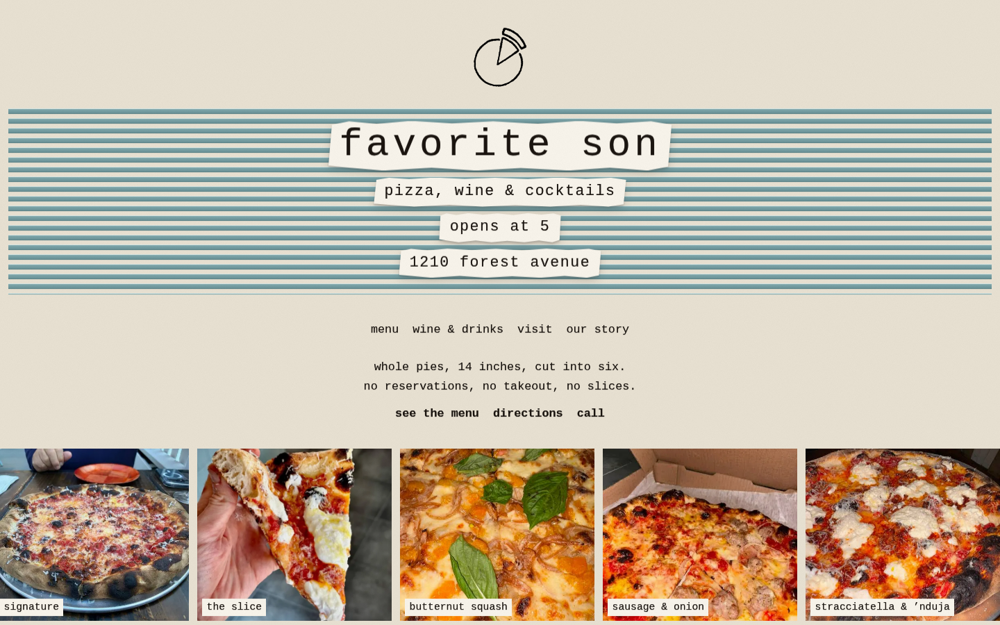

# Favorite Son

The website for Favorite Son Pizzeria & Wine Bar, 1210 Forest Avenue, Staten Island. I built it for the owner, so the details are meant to be exactly right: menu, hours, and the notes about how service works right now.

Live at [favoritesonnyc.vercel.app](https://favoritesonnyc.vercel.app).



## What's on the site

- Home page, menu, drinks, story and visit pages, plus a sitemap and robots file.
- The home page leads with the basics: whole 14 inch pies cut into six, the current service notice, the menu, directions and a phone link.
- Menu and wine list content is stored in the repo (`src/content/menu.ts`), with optional overrides from Sanity. If Sanity has nothing, the site falls back to the file, so it never shows an empty menu.
- Hours, the walk-in notice and anything 86'd for the night are in `src/content/site.ts`.
- The current PDF menus are in `menus/`. `favorite-son-research-brief.md` is background research and is not shown on the site.

## Stack

Next.js 16 (App Router), React 19, TypeScript, Tailwind CSS 4, Sanity (embedded Studio at `/studio`), deployed on Vercel.

## Running it locally

```sh
npm install
npm run dev
```

Open http://localhost:3000. The Sanity project and dataset default to the production ones, so no setup is needed to view the site. To point it somewhere else, copy `.env.example` to `.env.local` and set `NEXT_PUBLIC_SANITY_PROJECT_ID` and `NEXT_PUBLIC_SANITY_DATASET`.

Other scripts: `npm run build`, `npm run start` and `npm run lint`. `scripts/seed-sanity.mts` loads the static menu into Sanity and needs a write token.

## Changing the menu or hours

For a quick change, edit `src/content/menu.ts` or `src/content/site.ts` and deploy. For changes the owner makes himself, use the Studio at `/studio`.
